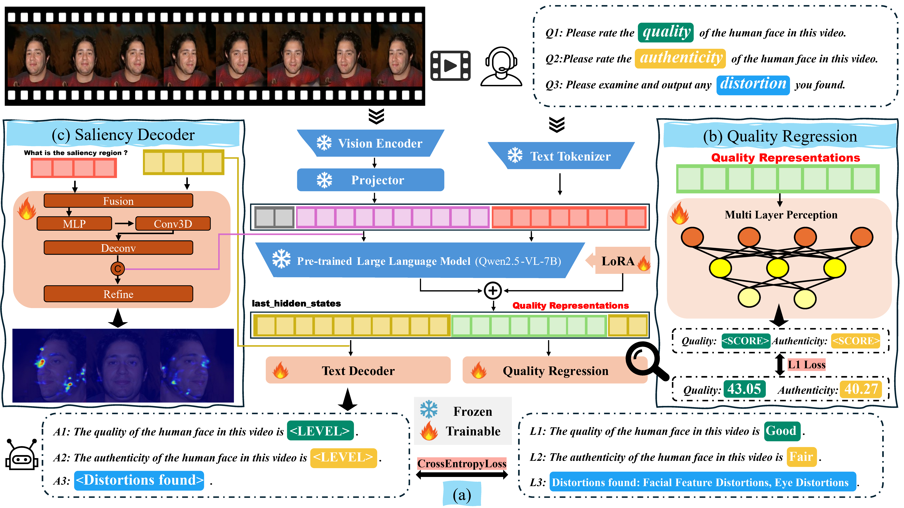

<div>
  <h1>LMME3DHF: Benchmarking and Evaluating Multimodal 3D Human Face Generation with LMMs</h1> 
</div>
<div align="center">
  <a href="https://arxiv.org/abs/2504.20466"></a>
  <a href="https://huggingface.co/datasets/yywooo/Gen3DHF"></a>
</div>

\


## 📌 Abstract
The rapid advancement in generative artificial intelligence have enabled the creation of 3D human faces (HFs) for applications including media production, virtual reality, security, healthcare, and game development, etc. However, assessing the quality and realism of these AI-generated 3D human faces remains a significant challenge due to the subjective nature of human perception and innate perceptual sensitivity to facial features. To this end, we conduct a comprehensive study on the quality assessment of AI-generated 3D human faces. We first introduce **`Gen3DHF`**, a large-scale benchmark comprising 2,000 videos of AI-Generated 3D Human Faces along with 4,000 Mean Opinion Scores (MOS) collected across two dimensions, i.e., quality and authenticity, 2,000 distortion-aware saliency maps and distortion descriptions. Based on Gen3DHF, we propose **`LMME3DHF`**, a Large Multimodal Model (LMM)-based metric for Evaluating 3DHF capable of quality and authenticity score prediction, distortion-aware visual question answering, and distortion-aware saliency prediction. Experimental results show that LMME3DHF achieves state-of-the-art performance, surpassing existing methods in both accurately predicting quality scores for AI-generated 3D human faces and effectively identifying distortionaware salient regions and distortion types, while maintaining strong alignment with human perceptual judgments. Both the Gen3DHF database and the LMME3DHF will be released upon the publication


## 📂 Gen3DHF Dataset
The Gen3DHF dataset is available on 🤗[HuggingFace](https://huggingface.co/datasets/yywooo/Gen3DHF).
\
Or using script:
``` bash
python download_dataset.py
# --target_dir: Replace with the directory to save (Default: "./Gen3DHF")   
# --dataset: Choose which dataset to download (Default: "image video_RGB saliency_map")
```

## ⚙️ Installion
Clone this repository:
``` bash
git clone https://github.com/YyWooo/LMME3DHF.git
cd lmme3dhf
```

Create and activate a conda environment:
``` bash
conda env create -f env.yml
conda activate lmme3dhf
```


## 🚀 Training
### Stage 1: Texture Output:
Results will be saved in "output" directory.
``` bash
./train_LLM.sh
# Edit the first line to set CUDA_VISIBLE_DEVICES

./merge_lora.sh
# --adapter: Path to Stage 1 results directory
```

### For stage 2 (Numerical Output):
Results will be saved in "output" directory.
``` bash
./train_MLP.sh

# Edit the first line to set CUDA_VISIBLE_DEVICES
# --model: Path to Stage 1 results directory

./merge_lora.sh
# --adapter: Path to Stage 2 results directory

CUDA_VISIBLE_DEVICES= python merge_mlp.py
# line 6: Change to Stage 2 results directory after merging LoRA
```


## 📊 Evaluation
``` bash
cd evaluate

CUDA_VISIBLE_DEVICES= python inference_text.py
# line 28: Path to pretrained networks (Stage 1)
# line 29: Path to evaluation dataset (e.g., "../datasets/text/eval_quality.json")

./inference_precise.sh
# --self_model: Path to Stage 2 model
# --val_dataset: Path to evaluation dataset (e.g., "../datasets/numerical/eval_quality.json")
```


## 📬 Contact
For any questions, please reach out to: `wooyiyang@sjtu.edu.cn`

## 📖 Citations
If you find this work useful, please cite:
```bibtex
@article{yang2025lmme3dhf,
  title={Lmme3dhf: Benchmarking and evaluating multimodal 3d human face generation with lmms},
  author={Yang, Woo Yi and Wang, Jiarui and Wu, Sijing and Duan, Huiyu and Zhu, Yuxin and Yang, Liu and Fu, Kang and Zhai, Guangtao and Min, Xiongkuo},
  journal={arXiv preprint arXiv:2504.20466},
  year={2025}
}
